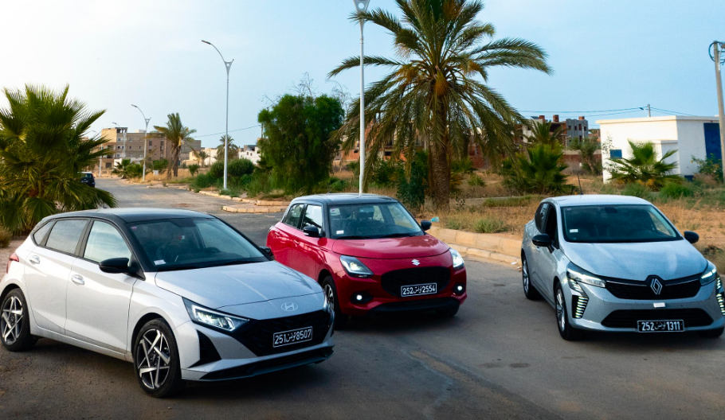

<div align="center">

# MLIK'A — Location de Voiture Premium en Tunisie

**Flotte récente · Livraison gratuite · Disponible 24h/24**

[](https://mlika-rental.vercel.app)
[](https://nextjs.org)
[](https://tailwindcss.com)
[](https://vercel.com)

</div>

---



---

## What is MLIK'A?

MLIK'A is a full-stack premium car rental platform built for the Tunisian market. Clients can browse the fleet, check availability, and book online in under 2 minutes. The owner receives instant Telegram notifications with one-tap confirm/reject buttons — no app needed.

---

## Features

| | Feature | Description |
|---|---|---|
| 🚗 | **Fleet catalog** | Browse cars with live availability and category filters |
| 📅 | **Online booking** | Full reservation flow with date picker and price negotiation |
| 📲 | **Telegram bot** | Instant notification with ✅ Confirm / ❌ Reject inline buttons |
| 🧠 | **AI Concierge** | Claude-powered chat assistant floating on every page |
| 📸 | **Photo uploads** | Admin uploads car images directly to Cloudinary |
| 🔐 | **Admin dashboard** | Full fleet & reservation management, mobile-friendly |
| 📱 | **Mobile-first** | Fully responsive from 320px to 4K |
| 🔍 | **SEO ready** | JSON-LD schema, sitemap, OG image, geo meta tags |

---

## Screenshots

### 🏠 Hero Section

> Editorial layout — giant H1 on the left, fleet photo bleeding from the right, booking widget overlaid bottom-right.

```
┌─────────────────────────────────────────────────────────────────┐
│  ── Tunisie · Depuis 2018                                       │
│                                                                 │
│  PRENEZ                                                         │
│  la Route                      🚗 🚗 🚗                         │
│  en grand.           ┌─────────────────────────────┐           │
│                      │  📅 Du ──── Au ────          │           │
│  [Réserver →]        │  📍 Lieu de prise en charge  │           │
│  [Voir la flotte]    │       [ Réserver ]           │           │
│                      └─────────────────────────────┘           │
└─────────────────────────────────────────────────────────────────┘
```

---

### 🚘 Fleet Section

> Live availability check · Filter by category · Featured badge

```
┌───────────────────┐  ┌───────────────────┐  ┌───────────────────┐
│  CITADINE         │  │  LE PLUS DEMANDÉ  │  │  PREMIUM          │
│                   │  │                   │  │                   │
│  [  car photo  ]  │  │  [  car photo  ]  │  │  [  car photo  ]  │
│                   │  │                   │  │                   │
│  HYUNDAI i20      │  │  SUZUKI Swift     │  │  RENAULT Clio     │
│  5 places · Man.  │  │  5 places · Auto  │  │  5 places · Hyb.  │
│                   │  │                   │  │                   │
│  89 DT / jour     │  │  110 DT / jour    │  │  135 DT / jour    │
│  [ Réserver ]     │  │  [ Réserver ]     │  │  [ Réserver ]     │
└───────────────────┘  └───────────────────┘  └───────────────────┘
```

---

### 📋 Booking Page — `/reserver`

> Two-panel layout: car selector on left, sticky form on right. Supports price negotiation.

```
┌──────────────────────────────┬────────────────────────────┐
│  Choisissez votre véhicule   │  Votre réservation         │
│                              │                            │
│  ┌──────────────────────┐    │  Du [──────] Au [──────]   │
│  │ 🚗 Hyundai i20  89DT │    │  Prise en charge [──────]  │
│  │ 🚗 Suzuki Swift 110DT│    │  Retour       [──────]     │
│  │ 🚗 Renault Clio 135DT│    │                            │
│  └──────────────────────┘    │  Nom complet  [──────────] │
│                              │  Téléphone    [──────────] │
│                              │  Âge          [──────────] │
│                              │  Permis (ans) [──────────] │
│                              │  Prix proposé [──────────] │
│                              │                            │
│                              │  [ Confirmer la réserv. → ]│
└──────────────────────────────┴────────────────────────────┘
```

---

### 📬 Telegram Bot Notification

> Every reservation sends this message to the owner's Telegram with one-tap action buttons.

```
┌─────────────────────────────────────────┐
│  🚗 Nouvelle Réservation — MLIK'A       │
│                                         │
│  👤 Client: Ahmed Ben Salem             │
│  📞 Téléphone: +216 52 526 595          │
│  🎂 Âge: 28 ans                         │
│  🪪 Permis depuis: 5 ans                │
│                                         │
│  🚘 Suzuki Swift Sport (2024)           │
│  📅 Du: 2025-06-01                      │
│  📅 Au: 2025-06-05 (4 jours)            │
│  📍 Prise en charge: Aéroport Tunis     │
│  💰 Tarif officiel: 440 DT (110 DT/j)  │
│  🤝 Contre-offre client: 400 DT         │
│  📉 Remise demandée: −9%                │
│                                         │
│  ⏳ Statut: En attente de confirmation  │
│                                         │
│  ┌──────────────┐  ┌──────────────────┐ │
│  │ ✅ Confirmer │  │  ❌ Rejeter      │ │
│  └──────────────┘  └──────────────────┘ │
│  ┌──────────────────────────────────┐   │
│  │ 📋 Toutes les réservations       │   │
│  └──────────────────────────────────┘   │
└─────────────────────────────────────────┘
```

---

### 🛠 Admin Dashboard — `/admin`

> Card-based layout (no horizontal scroll on mobile). Manage fleet and reservations from your phone.

```
┌──────────────────────────────────────────────────┐
│  MLIK'A Admin          [Réservations]  [Flotte]  │
├──────────────────────────────────────────────────┤
│  📦 3 voitures   📋 12 réservations              │
│  ⏳ 4 en attente  ✅ 8 confirmées                │
├──────────────────────────────────────────────────┤
│  Ahmed Ben Salem                  ⏳ En attente  │
│  🚘 Suzuki Swift · 01/06 → 05/06 · 440 DT        │
│  📍 Aéroport Tunis-Carthage                      │
│  🤝 Contre-offre: 400 DT (−9%)                   │
│  [ ✅ Confirmer ]  [ ❌ Rejeter ]  [ WhatsApp ]  │
└──────────────────────────────────────────────────┘
```

---

## Tech Stack

| Layer | Technology |
|---|---|
| **Framework** | [Next.js 14](https://nextjs.org) App Router |
| **Styling** | Tailwind CSS + CSS custom properties + `clamp()` fluid type |
| **Fonts** | Anton · Manrope · Instrument Serif via `next/font/google` |
| **Database** | JSON flat-file (`data/cars.json`, `data/reservations.json`) |
| **Images** | [Cloudinary](https://cloudinary.com) signed upload |
| **AI** | [Anthropic Claude](https://anthropic.com) Haiku (concierge chat) |
| **Notifications** | Telegram Bot API — text + inline keyboard callbacks |
| **Deployment** | [Vercel](https://vercel.com) — auto-deploy on `git push` |

---

## Project Structure

```
mlika-rental/
├── app/
│   ├── page.tsx                 # Homepage + JSON-LD SEO schema
│   ├── layout.tsx               # Global metadata, fonts, OG tags
│   ├── reserver/page.tsx        # Full booking flow
│   ├── admin/page.tsx           # Admin dashboard
│   ├── opengraph-image.tsx      # Auto-generated OG image
│   ├── sitemap.ts               # /sitemap.xml
│   ├── robots.ts                # /robots.txt
│   └── api/
│       ├── reservations/        # Book + list reservations
│       ├── cars/                # Fleet CRUD
│       ├── upload/              # Cloudinary signed upload
│       ├── chat/                # Claude AI concierge
│       ├── telegram-webhook/    # Handle bot button presses
│       └── telegram-setup/      # Register webhook with Telegram
├── components/
│   ├── Hero.tsx                 # Full-bleed editorial hero
│   ├── Nav.tsx                  # Hamburger mobile + desktop nav
│   ├── BookingWidget.tsx        # Quick booking form in hero
│   ├── FleetLoader.tsx          # Car grid with category filters
│   ├── FeaturesSection.tsx      # 3-col why-us grid
│   ├── ProcessSection.tsx       # How it works steps
│   ├── PricingStripe.tsx        # Pricing tiers
│   ├── ContactSection.tsx       # Contact info cards
│   ├── AIConcierge.tsx          # Floating AI chat widget
│   └── Footer.tsx               # 4-col responsive footer
├── lib/
│   ├── db.ts                    # Read/write JSON data files
│   └── notify.ts                # Build & send Telegram messages
└── public/assets/               # Car images (hero + fleet)
```

---

## Getting Started

```bash
# 1. Clone
git clone https://github.com/Aymenjallouli/MlikRentCar.git
cd MlikRentCar

# 2. Install
npm install

# 3. Create .env.local (see below)

# 4. Run
npm run dev
# → http://localhost:3000
```

### Environment Variables

```env
# Site
NEXT_PUBLIC_SITE_URL=http://localhost:3000

# Admin login
ADMIN_USERNAME=admin
ADMIN_PASSWORD=yourpassword
ADMIN_SECRET=your-random-secret-token

# Telegram
TELEGRAM_BOT_TOKEN=your_bot_token
TELEGRAM_CHAT_ID=your_personal_chat_id
TELEGRAM_WEBHOOK_SECRET=your_webhook_secret

# Cloudinary
CLOUDINARY_CLOUD_NAME=your_cloud_name
CLOUDINARY_API_KEY=your_api_key
CLOUDINARY_API_SECRET=your_api_secret
NEXT_PUBLIC_CLOUDINARY_CLOUD_NAME=your_cloud_name

# Anthropic Claude
ANTHROPIC_API_KEY=your_anthropic_key
```

> **Get your Telegram Chat ID:** Message your bot, then open  
> `https://api.telegram.org/bot<TOKEN>/getUpdates` and look for `"from":{"id": XXXXXXX}`

---

## Deployment

The project auto-deploys to Vercel on every `git push origin main`.

```bash
git add -A
git commit -m "your change"
git push
# → Vercel builds and deploys automatically
```

**After first deploy — activate Telegram buttons:**

```bash
curl "https://your-domain.vercel.app/api/telegram-setup?action=webhook&url=https://your-domain.vercel.app" \
  -H "x-admin-token: your-admin-secret"
```

---

## SEO Checklist

- [x] JSON-LD `CarRental` structured data
- [x] Auto-generated `/sitemap.xml`
- [x] `/robots.txt` (blocks `/admin` and `/api/`)
- [x] Open Graph + Twitter Card meta
- [x] Geo tags (`TN`, `Tunis`)
- [x] Dynamic OG image via Next.js ImageResponse
- [ ] Submit sitemap to [Google Search Console](https://search.google.com/search-console)
- [ ] Add custom domain and update `NEXT_PUBLIC_SITE_URL`

---

<div align="center">

**© 2025 MLIK'A — Ahmed Mlik · Tunis, Tunisie**

[🌐 Live Site](https://mlika-rental.vercel.app) · [📦 GitHub](https://github.com/Aymenjallouli/MlikRentCar)

</div>
